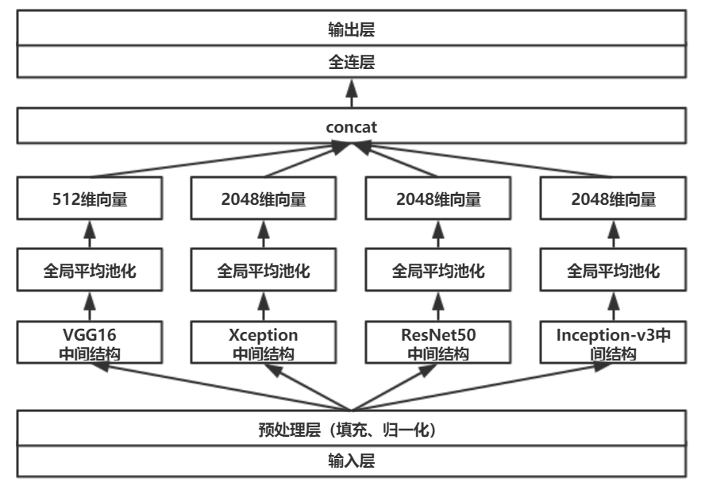

# 基于卷积神经网络的恶意软件检测方法

## 项目结构

```
software/                             // 可执行文件
    malware/
    normal/
utils/                                // 处理可执行文件的脚本
    exe_add_remove_prefix.py
    exe_filter.py
    exe_analyse.py
    exe_to_bytes.py
    exe_to_img.py
imgs/                                 // 灰度图像
    malware_img/
    normal_img/
data/                                 // 训练集和验证集
    train/
        malware/
        normal/
    valid/
        malware/
        normal/
split_data.py                         // 划分训练集和验证集
exe_rm.txt
loss_history.py                       // 绘制ACC曲线和LOSS曲线的共用类
model/                                // 存储模型
output/                               // 存储特征向量
result/                               // 存储模型验证结果
vgg16-finetune.py                     // VGG16单模型评测和特征向量提取
inceptionv3-finetune.py               // inception-v3单模型评测和特征向量提取
xception-finetune.py                  // xception单模型评测和特征向量提取
resnet50-finetune.py                  // resnet50单模型评测和特征向量提取
merge_all.py                          // 模型融合
my_model.py                           // 自定义模型
predict.py                            // 模型正确率、误报率、漏报率、时间开销评估
merge_all_predict.py                  // 模型正确率、误报率、漏报率评估
inception.py                          // 自定义inception模型（示例程序，不参与最后的模型评估）
run.sh
```

## 基本流程

### 收集数据

首先通过各种渠道收集大量的恶意软件和良性软件，其中良性软件主要来自于 WinXP、Win7、Win8、Win10 等几个系统。恶意软件主要来自专门收集恶意软件的网站。这里推荐一个[站点](https://virusshare.com/about.4n6)。

### exe_add_remove_prefix.py

为良性软件添加 winxp_、win7_、win8_、win10 前缀，用以区分来自不同操作系统的良性软件。

### exe_analyse.py

对恶意软件和良性软件的大小进行分析，通过分析我们可以得出以下结论：
- 有 99% 的良性软件大小在 0 ~ 8 MB 之间。
- 有 99.87% 的良性软件大小大于 1 KB。
- 有 99% 的恶意软件大小在 0 ~ 3 MB 之间。
- 有 99% 的恶意软件大小大于 200 B。

具体的分析结果如下所示：
```
====================================================================================================
良性软件总数： 10059
> 0 MB 的良性软件数量: 10059  100.00%
> 1 MB 的良性软件数量: 1935  19.24%
> 2 MB 的良性软件数量: 1110  11.03%
> 3 MB 的良性软件数量: 661  6.57%
> 4 MB 的良性软件数量: 372  3.70%
> 5 MB 的良性软件数量: 224  2.23%
> 6 MB 的良性软件数量: 160  1.59%
> 7 MB 的良性软件数量: 119  1.18%
> 8 MB 的良性软件数量: 78  0.78%
> 9 MB 的良性软件数量: 43  0.43%
> 10 MB 的良性软件数量: 0  0.00%
====================================================================================================
恶意软件总数： 57988
> 0 MB 的恶意软件数量: 57988  100.00%
> 1 MB 的恶意软件数量: 2092  3.61%
> 2 MB 的恶意软件数量: 920  1.59%
> 3 MB 的恶意软件数量: 558  0.96%
> 4 MB 的恶意软件数量: 304  0.52%
> 5 MB 的恶意软件数量: 163  0.28%
> 6 MB 的恶意软件数量: 91  0.16%
> 7 MB 的恶意软件数量: 71  0.12%
> 8 MB 的恶意软件数量: 64  0.11%
> 9 MB 的恶意软件数量: 50  0.09%
> 10 MB 的恶意软件数量: 46  0.08%
====================================================================================================
良性软件总数： 10059
> 0 KB 的良性软件数量: 10059  100.00%
> 1 KB 的良性软件数量: 10046  99.87%
> 2 KB 的良性软件数量: 10035  99.76%
> 3 KB 的良性软件数量: 10030  99.71%
> 4 KB 的良性软件数量: 10019  99.60%
> 5 KB 的良性软件数量: 10004  99.45%
> 6 KB 的良性软件数量: 9990  99.31%
> 7 KB 的良性软件数量: 9972  99.14%
> 8 KB 的良性软件数量: 9941  98.83%
> 9 KB 的良性软件数量: 9902  98.44%
> 10 KB 的良性软件数量: 9848  97.90%
====================================================================================================
恶意软件总数： 57988
> 0 KB 的恶意软件数量: 57988  100.00%
> 1 KB 的恶意软件数量: 55711  96.07%
> 2 KB 的恶意软件数量: 54521  94.02%
> 3 KB 的恶意软件数量: 53616  92.46%
> 4 KB 的恶意软件数量: 52961  91.33%
> 5 KB 的恶意软件数量: 52446  90.44%
> 6 KB 的恶意软件数量: 51812  89.35%
> 7 KB 的恶意软件数量: 51230  88.35%
> 8 KB 的恶意软件数量: 50403  86.92%
> 9 KB 的恶意软件数量: 49807  85.89%
> 10 KB 的恶意软件数量: 49154  84.77%
====================================================================================================
恶意软件总数： 57988
> 0 B 的恶意软件数量: 57988  100.00%
> 100 B 的恶意软件数量: 57791  99.66%
> 200 B 的恶意软件数量: 57555  99.25%
> 300 B 的恶意软件数量: 57315  98.84%
> 400 B 的恶意软件数量: 57094  98.46%
> 500 B 的恶意软件数量: 56903  98.13%
> 600 B 的恶意软件数量: 56475  97.39%
> 700 B 的恶意软件数量: 56268  97.03%
> 800 B 的恶意软件数量: 56119  96.78%
> 900 B 的恶意软件数量: 55971  96.52%
> 1000 B 的恶意软件数量: 55785  96.20%
```

### exe_filter.py

通过对恶意软件和良性软件的大小进行分析，我们可以对恶意软件和良性软件进行初步的筛选：
- 删除大小大于 2 MB 或者小于 500 B 的恶意软件。
- 删除大小大于 5 MB 或者小于 1KB 的良性软件。 
在项目根目录下生成 `exe_rm.txt` 文件，该文件记录了所有的要删除的 exe 文件名。

### exe_to_img.py

将可执行文件转为灰度图片。

### split_data.py

划分数据集，产生 `data/` 文件夹，其中划分规则大致如下：

- 良性软件和恶意软件一样多
- 80% 的数据划入训练集，20% 的数据划入验证集

程序运行结果如下：
```
Backdoor num: 10854
Trojan num: 24428
worm num: 1349
exploit num: 409
正常软件的数量: 9822
恶意软件的数量: 9820
```

### run.sh

训练所有模型并评估。

## 模型融合示意图



其他模型的示意图也存放在 result 文件夹下。

## 评估结果

模型名 | 正确率 |  误报率 | 漏报率 | 时间开销 
-|-|-|-|-
VGG16 | 95.92% | 3.46% | 4.59% | 58s
Xception | 95.16% | 6.87% | 2.80% | 62s
inception-v3 | 94.20% | 5.95% | 5.65% | 47s
ResNet50 | 94.40% | 6.26% | 4.94% | 54s
模型融合 | 96.65% | 3.21% | 3.49% | /
自定义模型 | 96.75% | 3.11% | 3.39% | 73s
